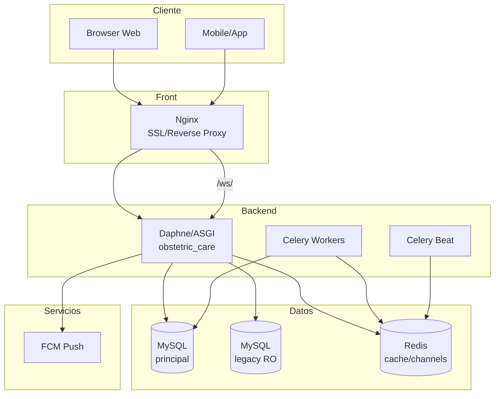
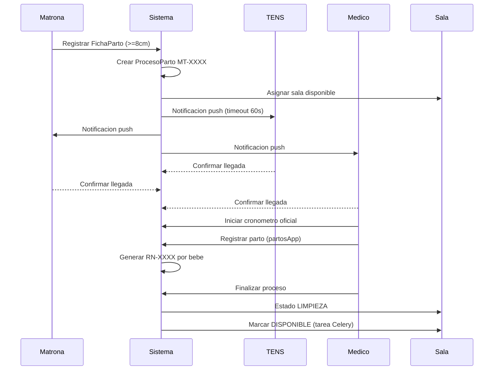
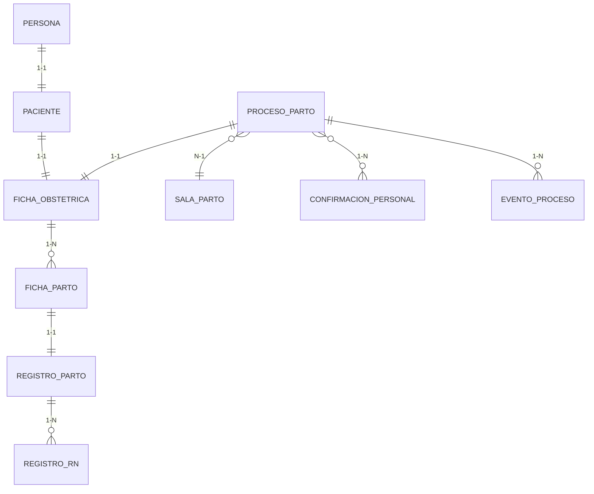
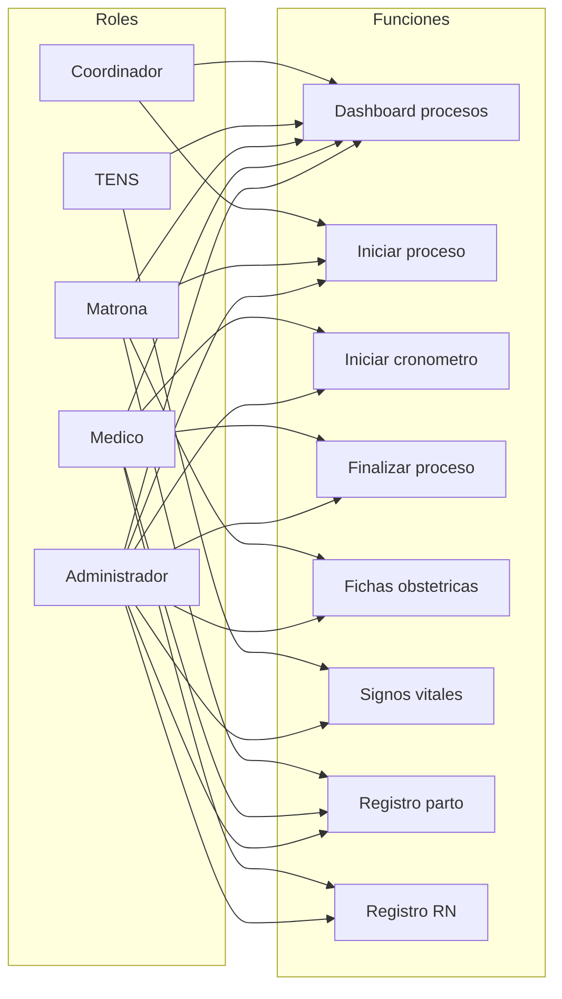
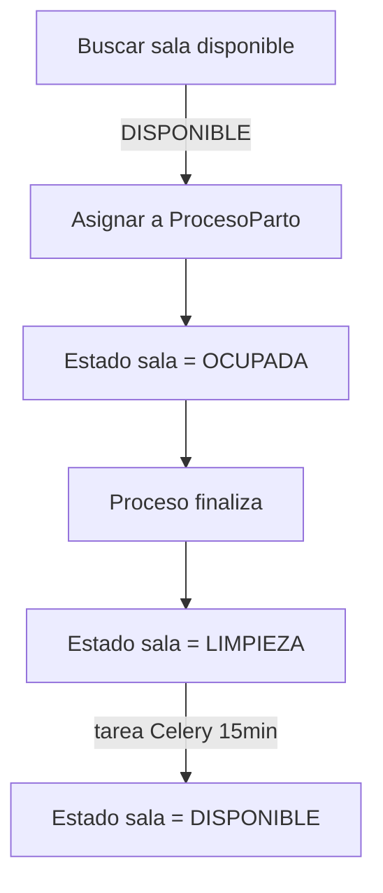

# Documentacion del proyecto OB_CARE (detallada)

## 1. Proposito y alcance
- Plataforma Django para trazabilidad obstetrica en hospital: personas/personal, flujo completo de parto, registro de parto y recien nacido, auditoria y notificaciones en tiempo real.
- Usuarios objetivo: medico, matrona, tens, coordinador y administrador.
- Ambitos cubiertos: ingreso y ficha obstetrica, ingreso a parto, proceso operativo en sala, registro de parto (9 pasos), registro RN, integracion con base legacy y reportabilidad basica.

## 2. Arquitectura general
- **Backend**: Django + Django REST Framework; ASGI (Daphne) con Django Channels para WebSocket; Celery + Redis para tareas async; MySQL como base principal y base legacy de solo lectura.
- **Front**: Templates Bootstrap 5 + Bootstrap Icons; JS minimo para cronometros y actualizaciones en tiempo real (via Channels cuando aplica).
- **Infra**: Nginx como reverse proxy/SSL terminator; Dockerfile y docker-compose para web, db, redis, celery y celery-beat.
- **Configuracion por entorno**: settings/base.py + development.py + production.py + testing.py; variables de entorno para credenciales, hosts, FCM, Redis y JWT.
- **Archivos estaticos/media**: static/ para desarrollo, staticfiles/ recolectado en prod, media/ para uploads.
- **Seguridad transversal**: middleware LoginRequired + RoleMiddleware, CSRF habilitado, FK con PROTECT en catalogos, cookies secure en prod, HSTS/SSL redirect, validadores de RUT/telefono/rangos.

## 3. Capas y componentes
- **Core**: modelos abstractos (TimeStamped, Audited, SoftDelete, CatalogoBase/ConColor), mixins de vistas (roles, ajax, paginacion, export), decoradores de roles, utils (RUT, edad, moneda, cache) y validadores. Plantillas base y partials (navbar/sidebar/messages/pagination/modal) + constantes y context processors (hospital_info, user_permissions, menu_items).
- **Autenticacion/Inicio**: login personalizado (logging IP), logout, screensaver institucional, redireccion por rol (`get_dashboard_url_for_user`), decoradores `roles_required` y `role_required`. Dashboards por rol ubicados en templates/Gestion/Data/.
- **Gestion de personas (gestionApp)**: entidad base `Persona` (RUT unico) y especializaciones 1:1 (`Paciente`, `Medico`, `Matrona`, `Tens`); catalogos sexo/nacionalidad/pueblo/estado civil/prevision/turno/especialidad/nivel/certificacion; formularios y vistas CRUD + busqueda por RUT; soft delete via `activo`.
- **Matrona (matronaApp)**: `FichaObstetrica` (antecedentes, gestaciones, patologias CIE-10, examenes), `IngresoPaciente`, `MedicamentoFicha`, `AdministracionMedicamento`; catalogos de via de administracion y consultorio; vistas para fichas, medicamentos y administraciones.
- **Medico (medicoApp)**: catalogo `Patologias` CIE-10 (CRUD + API de busqueda) asociable a fichas obstetricas.
- **TENS (tensApp)**: `RegistroTens` de signos vitales y `Tratamiento_aplicado` con medicamento/dosis/via; vistas de registro e historico por ficha.
- **Ingreso a parto (ingresoPartoApp)**: `FichaParto` (tipo paciente, origen, examenes VIH/SGB/VDRL/HepB, patologias activas, estado cervical/fetal); catalogos estado cervical/fetal.
- **Registro de parto (partosApp)**: `RegistroParto` (9 pasos, clasificacion Robson, posiciones, perine, anestesia, alumbramiento, apego, Ley Dominga) con catalogos de parto; relacion 1:1 con `FichaParto` y FK a `FichaObstetrica`.
- **Recien nacido (recienNacidoApp)**: `RegistroRecienNacido` (sexo, peso/talla/apgar, cordon, apego, alimentacion, evaluaciones, complicaciones) y catalogo de sexo RN; relacion N:1 con `RegistroParto`.
- **Procesos de parto (gestionProcesosApp)**: modelo central `ProcesoParto` (codigo MT-XXXX, ficha obstetrica, sala, tipo paciente/proceso, prioridad, riesgo, estados) + `SalaParto` (estado, capacidad, limpieza), `ConfirmacionPersonal` (timeout 60s), `AsignacionPersonal`, `EventoProceso` y catalogos de estados/roles. Servicios para asignacion de salas, calculo de personal por numero de bebes, notificaciones push (FCM), cronometro oficial iniciado solo por medico, derivaciones y limpieza automatica de sala.
- **Legacy (legacyApp)**: `ControlesPrevios` (managed=False) via router `legacy` para consultas de datos historicos de la base antigua.

## 4. Modelo de datos y relaciones clave
- Base de personas: `Persona` (RUT PK) -> 1:1 `Paciente`/`Medico`/`Matrona`/`Tens`; catalogos normalizados via FK PROTECT.
- Cadena clinica: `Paciente` -> `FichaObstetrica` (matrona) -> `FichaParto` (ingreso) -> `RegistroParto` (9 pasos) -> `RegistroRecienNacido` (N:1).
- Proceso operativo: `ProcesoParto` referencia `FichaObstetrica`, `SalaParto`, estados de proceso/sala y roles; `ConfirmacionPersonal` enlaza Users y `CatalogoRolProceso`; `RegistroRecienNacido` llega via `RegistroParto` al cierre del proceso. Diagrama mermaid de personas en `diagrama er.md`.

## 5. Flujos funcionales detallados
1) **Ingreso y ficha obstetrica**
   - Registrar Persona/Paciente (validacion de RUT, contacto, catalogos base).
   - Crear `FichaObstetrica`: antecedentes, gestas/partos, patologias CIE-10, examenes (VIH, SGB, VDRL, HepB), datos antropometricos.
   - Asignar medicamentos (`MedicamentoFicha`) y administrar (`AdministracionMedicamento`), mas controles TENS (`RegistroTens`).

2) **Ingreso a parto (8cm rule)**
   - Crear `FichaParto` con tipo paciente/origen, examenes al ingreso y patologias activas.
   - Regla de negocio: proceso se inicia a 8cm para optimizar uso de salas.

3) **Proceso de parto (gestionProcesosApp)**
   - Generar codigo MT-XXXX, calcular personal requerido (por bebe: 1 medico + 1 matrona + 1 tens + 2 tens fijos), asignar `SalaParto` disponible.
   - Enviar notificaciones push (FCM); `ConfirmacionPersonal` con timeout 60s; llegada secuencial TENS -> Matrona -> Medico.
   - Medico inicia cronometro oficial (unico evento). Eventos trazados en `EventoProceso`.
   - Soporta emergencias externas (tiempo estimado de llegada) y derivaciones (UCI/Neonatologia). Sala pasa a limpieza al cierre y luego disponible.

4) **Registro de parto (partosApp)**
   - 9 pasos: datos obstetricos, alumbramiento, perine, anestesia, metodo no farmacologico, acompanante, apego, Ley Dominga, observaciones.
   - Genera numero PARTO-XXXX; vinculo 1:1 con `FichaParto` y FK a `FichaObstetrica`.

5) **Registro recien nacido (recienNacidoApp)**
   - Por cada bebe: codigo RN-XXXX, sexo, peso/talla/apgar, clampeo oportuno, apego, alimentacion, evaluaciones, complicaciones, documentos.
   - N:1 con `RegistroParto`; valida rangos (peso/talla/apgar).

6) **Post-proceso y limpieza**
   - Medico finaliza proceso: valida RN completos, cierra cronometro, libera sala -> estado LIMPIEZA -> tarea Celery la marca DISPONIBLE tras tiempo configurado.
   - Auditoria: created/updated_by en modelos auditados; eventos de proceso y logs.

## 6. Roles y permisos
- Grupos Django: administrador, medico, matrona, tens, coordinador; superuser con acceso total.
- Middleware RoleMiddleware expone roles en request y contexto; mixins/decoradores para restringir vistas (`RoleRequiredMixin`, `role_required`, `AjaxRequired`).
- Matriz resumida: medico puede iniciar/finalizar cronometro y derivar; matrona gestiona fichas y medicamentos; tens registra signos/tratamientos; coordinador puede iniciar proceso y ver estados; admin gestiona usuarios y catalogos.

## 7. APIs, tiempo real e integraciones
- DRF: auth por Session o JWT (SimpleJWT), paginacion PageNumber, filtros/busqueda/orden; serializers base en core/api.
- Channels (ASGI): WebSocket para tableros en tiempo real (procesos, salas); capa en memoria en dev y Redis en prod.
- Celery: tareas `verificar_confirmaciones_timeout` (cada 10s), `limpiar_salas` (cada 60s) y `buscar_reemplazo`; JSON serializer y zona horaria America/Santiago.
- FCM: envio de notificaciones push al personal asignado.
- Legacy: router `legacy` hacia base de datos historica (managed=False) para consultas de `ControlesPrevios` (solo lectura).

## 8. Seguridad y cumplimiento
- Autenticacion obligatoria salvo rutas de login/logout/static/media; sessions con 8h y expiracion al cerrar navegador.
- CSRF activo; cookies secure y HSTS en produccion; X-Frame-Options DENY, content type nosniff.
- Validadores: RUT, telefono chileno, rangos clinicos (temperatura, FC, FR, saturacion, peso/talla RN, APGAR, dilatacion).
- FK con PROTECT en catalogos; soft delete con `activo`/`is_active`; auditoria de usuario en modelos auditados.
- Logging a archivo en prod (app.log y error.log, plus logs de procesos) y JSON opcional.

## 9. Despliegue y operaciones
- Requisitos: Python 3.10, libmysqlclient, Redis, MySQL 8; dependencias en `requirements.txt`.
- Migraciones: `python manage.py makemigrations` / `migrate` (solo base principal) / `migrate gestionProcesosApp` para app puntual.
- Estaticos: `python manage.py collectstatic --noinput` para prod (WhiteNoise para servir).
- Docker: compose incluye web (Daphne), db, redis, celery, celery-beat; Nginx sample para SSL y rutas /ws/.
- Variables de entorno criticas: SECRET_KEY, ALLOWED_HOSTS, DB_* y LEGACY_DB_*, REDIS_URL/HOST, FCM keys, JWT lifetimes, DEBUG.
- Comandos utiles: tests con pytest, coverage; manejar cache Redis si aplica; `createsuperuser` para primer acceso.

## 10. Observabilidad y auditoria
- Logs de login (IP, usuario), logs de acciones via decorador `log_action` y logger `obstetric_care`.
- Auditlog middleware habilitado para todas las entidades (AUDITLOG_INCLUDE_ALL_MODELS=True).
- Eventos de proceso y cronometro guardan timestamps para medir SLA (confirmacion <60s, apego 5min, limpieza 15min).

## 11. Pruebas
- Pytest configurado (pytest.ini).
- Casos clave: registro persona y validacion RUT; duplicados; procesos CP-001..CP-010 (gestionProcesosApp) para reglas 8cm, personal, cronometro, derivaciones; validadores de rangos clinicos y RN.
- Coverage sugerido: `pytest gestionProcesosApp/tests --cov=gestionProcesosApp --cov-report=html` y suites de core/gestionApp.

## 12. Referencias y apoyos
- Documentacion detallada por app en `*/documentacion/*.md` (core, gestionApp, matronaApp, medicoApp, tensApp, ingresoPartoApp, partosApp, recienNacidoApp, gestionProcesosApp, legacyApp, inicioApp/authentication).
- Diagrama ER de personas en `diagrama er.md`; arquitectura y flujo extendido en documentacion de cada app; informe previo en `INFORME_FINAL.md`.
- Para ampliar diagramas, usar mermaid en nuevos apartados (ej: flujo de proceso de parto y asignacion de sala/confirmaciones).

## 13. Modelos por aplicacion (lista rapida)
- **core**: TimeStampedModel, AuditedModel, SoftDeleteModel, CatalogoBase, CatalogoConColor, utilidades (no persistentes).
- **gestionApp**: CatalogoSexo, CatalogoNacionalidad, CatalogoPuebloOriginario, CatalogoEstadoCivil, CatalogoPrevision, CatalogoTurno, CatalogoEspecialidad, CatalogoNivelTens, CatalogoCertificacion, Persona, Paciente, Medico, Matrona, Tens.
- **matronaApp**: CatalogoViaAdministracion, CatalogoConsultorioOrigen, FichaObstetrica, IngresoPaciente, MedicamentoFicha, AdministracionMedicamento.
- **medicoApp**: Patologias (CIE-10).
- **tensApp**: RegistroTens, Tratamiento_aplicado.
- **ingresoPartoApp**: CatalogoEstadoCervical, CatalogoEstadoFetal, FichaParto.
- **partosApp**: CatalogoTipoParto, CatalogoClasificacionRobson, CatalogoPosicionParto, CatalogoEstadoPerine, CatalogoCausaCesarea, CatalogoMotivoPartoNoAcompanado, CatalogoPersonaAcompanante, CatalogoMetodoNoFarmacologico, RegistroParto.
- **recienNacidoApp**: CatalogoSexoRN, RegistroRecienNacido.
- **gestionProcesosApp**: CatalogoEstadoProceso, CatalogoEstadoSala, CatalogoTipoPaciente, CatalogoTipoProceso, CatalogoPrioridad, CatalogoNivelRiesgo, CatalogoRolProceso, ProcesoParto, SalaParto, ConfirmacionPersonal, AsignacionPersonal, EventoProceso.
- **legacyApp**: ControlesPrevios (managed=False, solo lectura).
- **inicioApp/authentication**: RegistroAcceso (si existe), decoradores y utilidades; dashboards por rol.

## 14. Diagramas sugeridos (Mermaid)

### 14.1 Arquitectura de despliegue

### 14.2 Flujo operativo de proceso de parto

### 14.3 ER de cadena clinica (simplificado)

### 14.4 Roles y accesos

### 14.5 Asignacion de sala y limpieza

