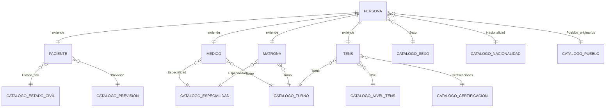

# Diagrama ER - OB_CARE

## Vista general

## Entidades principales
- `Persona` (PK: Rut) Campos: nombre, apellidos, fecha_nacimiento, inmigrante, discapacidad, tipo_discapacidad, privada_de_libertad, trans_masculino, telefono, direccion, email, activo. FK: `Sexo`, `Nacionalidad`, `Pueblos_originarios`.
- `Paciente` (PK/FK: persona) Campos: estado_civil, previcion, paridad, ductus_venosus, control_prenatal, consultorio, preeclampsia_severa, eclampsia, sepsis_o_infeccion_sist, infeccion_ovular_o_corioamnionitis, acompanante, contacto_emergencia, fecha_y_hora_ingreso, activo.
- `Medico` (PK/FK: persona) Campos: especialidad, registro_medico, anos_experiencia, turno, activo.
- `Matrona` (PK/FK: persona) Campos: especialidad, registro_medico, anos_experiencia, turno, activo.
- `Tens` (PK/FK: persona) Campos: nivel, anos_experiencia, turno, certificaciones, activo.

## Catálogos normalizados (todos con PK `id`, campos base `codigo`, `nombre`, `descripcion`, `orden`, `activo`)
- `CatalogoSexo`
- `CatalogoNacionalidad`
- `CatalogoPuebloOriginario`
- `CatalogoEstadoCivil`
- `CatalogoPrevision`
- `CatalogoTurno`
- `CatalogoEspecialidad`
- `CatalogoNivelTens`
- `CatalogoCertificacion`

## Notas
- `Persona` es la entidad base; Paciente, Medico, Matrona y Tens usan relación 1 a 1 para especializarla.
- Todos los catálogos se referencian con FK `PROTECT` para evitar borrados accidentales.
- Eliminaciones lógicas mediante campo `activo` en entidades principales.
